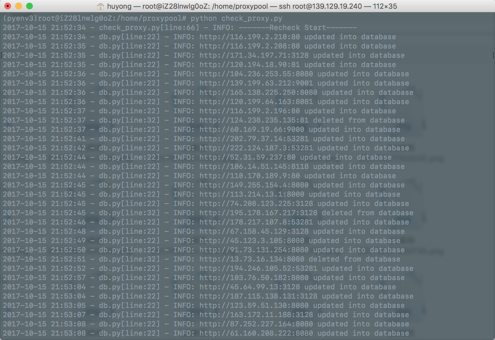

# proxypool
[中文版本](README_zh.md)

Proxypool is a project  to spider free proxies and check them whether are still useful in a regular interval.
What's more , it provide an open Web-API service: [proxypool-open-WebAPI](http://proxy.nghuyong.top/)

## Clone and Use
This project is developed based on python3 and you'd better use virtualenv

    # clone project 
    git clone https://github.com/SimpleBrightMan/proxypool.git
    cd proxypool
    # install requriements
    pip install -r requirements.txt
    # run spider
    python proxy_spider.py
    # recheck proxies
    python check_proxy.py
   
If everything is ok , it may appear the screenshots as follows：
- run spider


- recheck proxies




## WebAPI

    # run webAPI
    python webAPI.py 8080
Then visit [http://127.0.0.1:8080](http://127.0.0.1:8080),and you can call the Web-API.

In addition, I have deployed this project on my server, it will auto spider and recheck the proxies every 6 hours , the open API URL is :[proxypool-open-WebAPI](http://proxy.nghuyong.top/)

### Instruction for Web-API
URL : [http://127.0.0.1:8080](http://127.0.0.1:8080) or [http://proxy.nghuyong.top](http://proxy.nghuyong.top)

Method : GET

Return : json format,liking：

    {
        num: 692,
        updatetime: "2017-10-15 22:49:16",
        data: [
            {
                type: "http",
                round_trip_time: 1.38,
                ip_and_port: "181.193.73.18:53281",
                country: "Costa Rica",
                anonymity: "transparent"
            },
            {
                type: "http",
                round_trip_time: 0.52,
                ip_and_port: "113.214.13.1:8000",
                country: "China",
                anonymity: "high_anonymity"
            },
            {
                type: "http",
                round_trip_time: 0.58,
                ip_and_port: "159.82.166.133:8080",
                country: "United States",
                anonymity: "normal_anonymity"
            },
            ...
        ]
    }
the explanation of the return json args：


| agrs           | format       | description   |
|:--------------:|:-------------:|:-----:|
| num           | int           | the sum of the return proxies|
| updatetime    | char          | the latest update time |
| data          | list          | proxies data |
| type          | char          | the type of the proxy|
| round_trip_time|double        |the round-trip-time of using the proxy to request the test website|
| ip_and_port   | char          |the ip and port of  the proxy|
| country       | char          |the country of the proxy|
| anonymity     | char          |the anonymity of the proxy, this arg can be transparent, normal_anonymity and high_anonymity|

the args for request this Web-API：
- /: it will return all the proxies
- /?country=China: it will return proxies of specific country 
- /?type=http: it will return proxies of specific type 
- /?anonymity=normal_anonymity: it will return proxies whose anonymity-level are higher than or equal to the query anonymity，and the anonymity-level is :transparent<normal_anonymity<high_anonymity
- /?num=100: it will return the top 100 proxies sorted by anonymity and round-trip-time.

And these query args can be used in a group, for example：/?country=China&anonymity=high_anonymity&num=10 , and it will return 10 proxies whose country is China and anonymity is high-anonymity.

### Use the Web-API in your spider project 
```python
import requests
# request the API，and parse json to dictionary
proxy_result = requests.get("http://proxy.nghuyong.top").json()
num = proxy_result['num']
updatetime = proxy_result['updatetime']
proxy_data = proxy_result['data']
# get a proxy
one_proxy = proxy_data[0]
# add the proxy to a request
requests.get("http://www.baidu.com",proxies={"http":one_proxy['type']+"://"+one_proxy['ip_and_port']})
```
